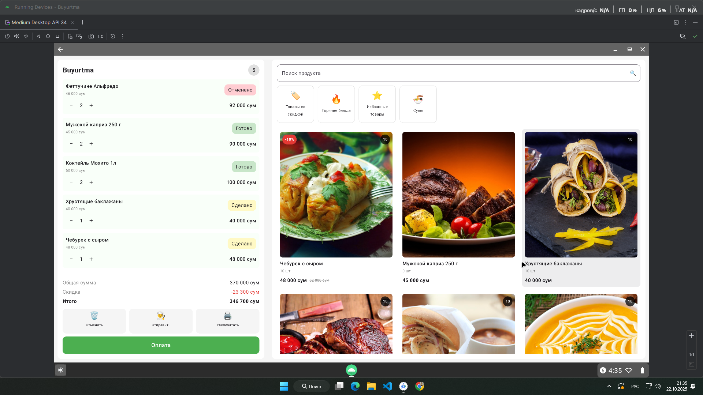

# 🍽️ Buyurtma App

**Buyurtma** — это демонстрационное приложение Android, разработанное на **Jetpack Compose (MVI архитектура)**, для оформления и управления заказами.  
Приложение демонстрирует современный подход к UI, работу с состоянием (StateFlow / SharedFlow) и интерактивные карточки товаров и корзины.

---

## 📸 Скриншот

  

---

## 🧱 Стек технологий

- **Kotlin**
- **Jetpack Compose**
- **Material 3**
- **MVI (Model–View–Intent)**
- **StateFlow / SharedFlow**
- **Coroutines**

---

## 🧩 Архитектура

Проект построен по **MVI-подходу**:
- **Model** — `OrderState`, `Product`, `CartItem`, `Category`
- **Intent** — `OrderIntent` (действия пользователя)
- **Effect** — `OrderEffect` (одноразовые события, например: "Чек распечатан")
- **ViewModel** — `OrderViewModel` управляет состоянием и бизнес-логикой
- **UI** — Компоненты Jetpack Compose (`OrderScreen`, `ProductCard`, `CartPanel` и т.д.)

---

## ⚙️ Основные функции

- 📦 Просмотр списка продуктов  
- 🛒 Добавление товаров в корзину  
- ✏️ Изменение количества позиций  
- 💰 Расчет общей суммы, скидки и финальной стоимости  
- 🚫 Автоматическое отключение товаров без остатка  
- 💳 Эмуляция оплаты  
- 🧾 Отправка на кухню и печать чека  
- 🔍 Поиск и фильтрация по категориям  
- 🔄 Реактивное обновление интерфейса через StateFlow  

---

## 🧠 Структура проекта

